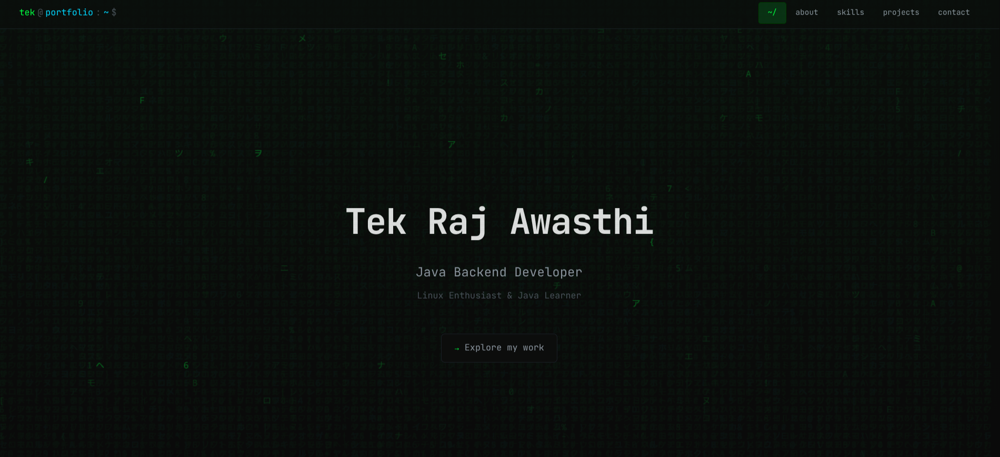
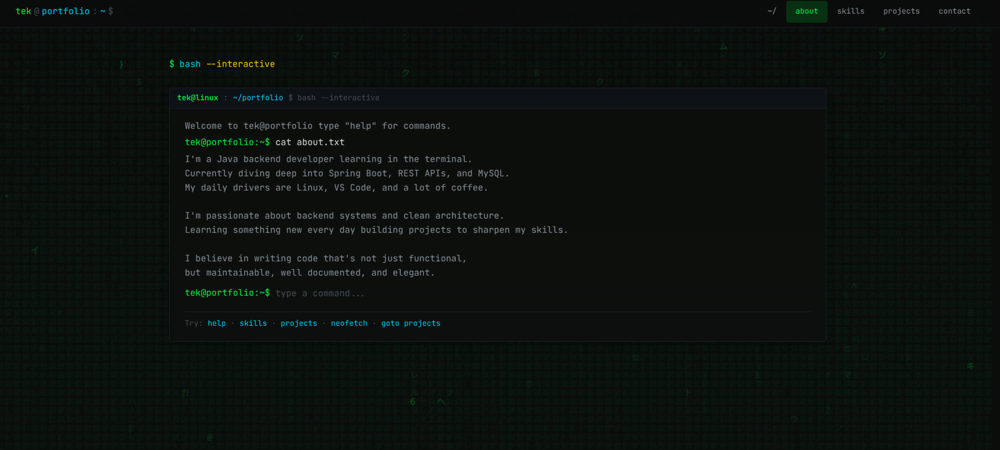
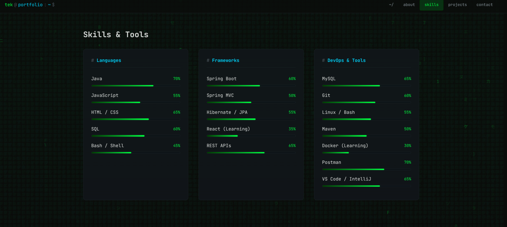
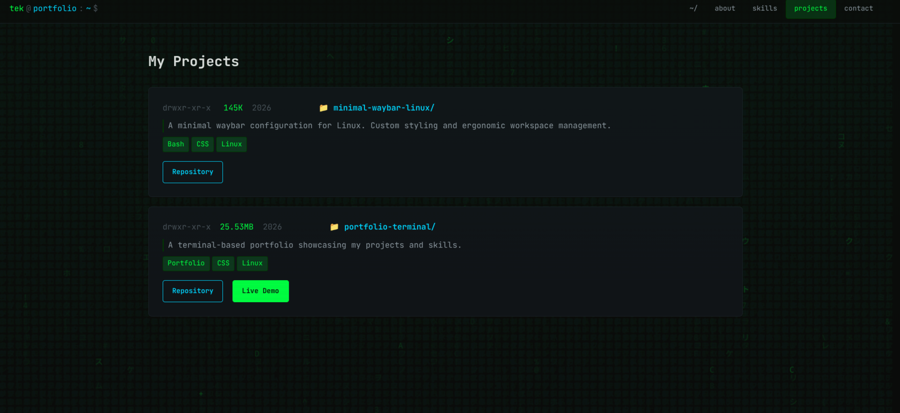
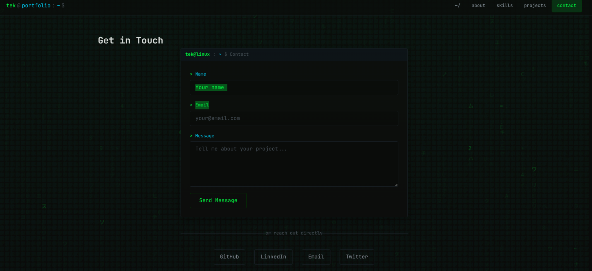

# 💻 Linux Portfolio

A modern Linux terminal-inspired developer portfolio built with React and Vite.

## 🌐 Live Demo

https://portfolio-b17.vercel.app

---

## ✨ Features

- 🐧 Linux-inspired interface
- ⚡ Fast React + Vite application
- 📱 Responsive design
- 💼 Projects showcase
- 🛠 Skills section
- 📞 Contact section
- 🎨 Modern UI and animations

---

## 🛠 Tech Stack


- React
- Vite
- JavaScript
- HTML5
- CSS3
- Git
- GitHub
- Vercel

---

## 🚀 Installation

Clone the repository

```bash
git clone https://github.com/your-username/your-repo.git
```

Install dependencies

```bash
npm install
```

Run locally

```bash
npm run dev
```

Build

```bash
npm run build
```

---

## 📂 Project Structure

```
src/
public/
pagescreenshot/
```

---

## 📷 Screenshots

### Home Page


### About / Terminal Section


### Skills Section


### Project Section


### Contact Section


---

## 🌍 Live Website

https://portfolio-b17.vercel.app

---

## 📜 License

This project is licensed under the MIT License.
